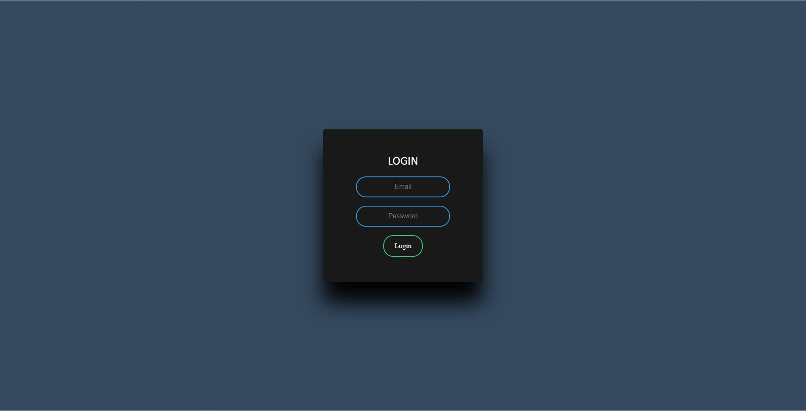
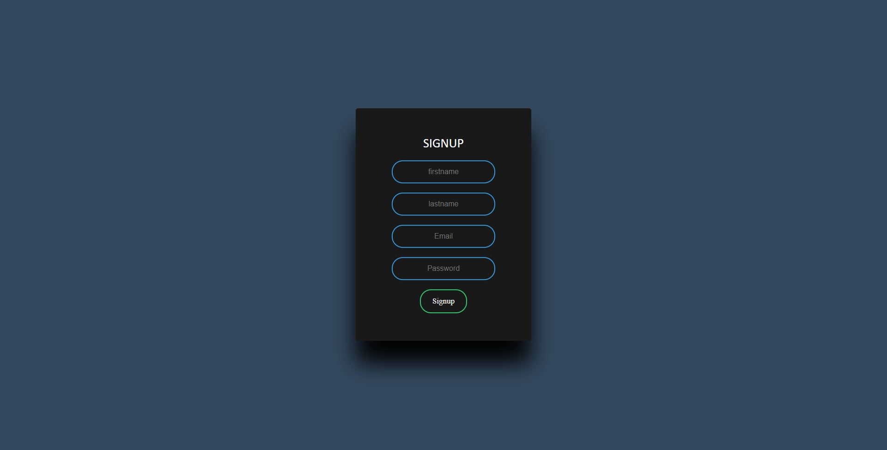
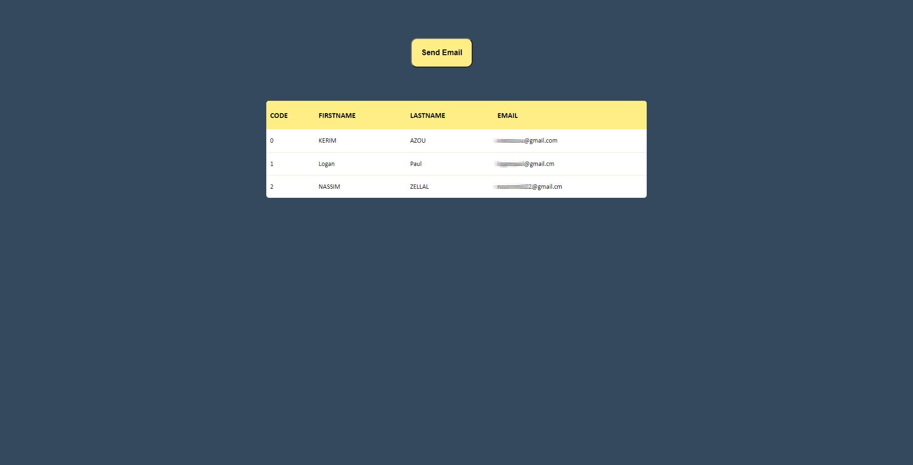
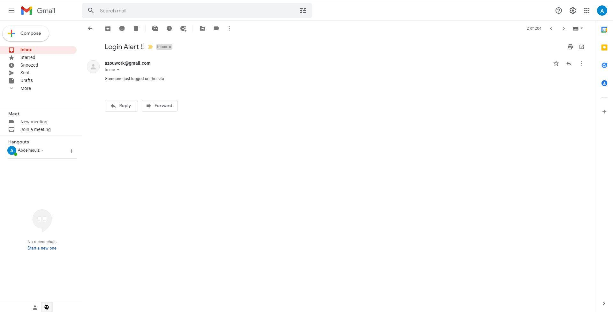

# SpringBoot: Email Sender Service with MySql

## Table of contents

1. [Overview](#Overview)
2. [Installation](#installation)
    1. [EmailSender](#EmailSender)
    2. [MySql](#MySql)
4. [Sending Email](#Sending_Email)
    1. [Databases's Emails](#Db-Email)
    2. [Costume Email](@Costume-Email)
5. [Exemples](#Exemples)


## Overview<a name="Overview"></a>

In this Spring Boot project,  we'll walk through the steps needed to send emails from Spring Boot application. For the former, we'll use the JavaMail library, and the latter will use the spring-boot-starter-mail dependency.


<br/>

## Installation<a name="installation"></a>

### 1. EmailSender<a name="EmailSender"></a>


First, we need to add the dependencies to our pom.xml.


```
<dependency>
    <groupId>org.springframework</groupId>
    <artifactId>spring-context-support</artifactId>
    <version>5.2.8.RELEASE</version>
</dependency>
```


Once the dependency is in place, the next step is to specify the mail server properties in the application.properties file using the spring.mail.* namespace.

We can specify the properties for the Gmail SMTP server this way:

```
spring.mail.host=smtp.gmail.com
spring.mail.port=587
spring.mail.username=<login user to smtp server>
spring.mail.password=<login password to smtp server>
spring.mail.properties.mail.smtp.auth=true
spring.mail.properties.mail.smtp.starttls.enable=true
```

We can send an email via Gmail SMTP server. Have a look at the [documentation](https://support.google.com/mail/answer/7104828?hl=en&rd=3&visit_id=637812960575206948-2906502522) to see the Gmail outgoing mail SMTP server properties.

Our application.properties file is already configured to use Gmail SMTP (see the previous section).

Note that the password for our account should not be an ordinary password but an application password generated for our Google account. Follow this link to see the details and to generate your Google App Password.
<br/><br/>

### 2. MySql<a name="MySql"></a>

We'll start by looking at arguably the most popular options using JDBC
We'll also need the mysql-connector-java artifact which as always is available from Maven Central:

```
<dependency>
    <groupId>mysql</groupId>
    <artifactId>mysql-connector-java</artifactId>
    <version>8.0.19</version>
</dependency>
```

JDBC (Java Database Connectivity) is an API for connecting and executing queries on a database.

```
server.port=8081
spring.datasource.url=jdbc:mysql://localhost:3306/user
spring.datasource.username=root
spring.datasource.password='Your Mysql password'
spring.jpa.hibernate.ddl-auto=update
```
<br/><br/>

## Sending Email<a name="Sending_Email"></a>

### 1. Databases's Emails<a name="Db-Email"></a>


Let's first compose and send a simple email message :

```
@Service
public class MailSenderService{
	
	@Autowired
	private JavaMailSender mailSender;

	public void sendMail(String[] emailIds, String body, String subject) {
		SimpleMailMessage message = new SimpleMailMessage();
		message.setFrom("Your Email");
		message.setTo(emailIds);
		message.setText(body);
		message.setSubject(subject);
		mailSender.send(message);
		System.out.println("email sent");
	}

}
```
<br/>

Now using the sendMail methode in MailSenderService.java we can send emails to all the users in our database.
<br/>

```
@GetMapping(path="/send")
	public boolean Send() {
				
  	String sql = "SELECT * FROM user ";
	  String subject = "Login Alert !!";
	  String body = "Someone just logged on the site";
			        
		List<User> users = jdbcTemplate.query(sql,new UserMapper());
				 	
	  String[] emailIds = new String[users.size()];
				 	
		for(int i=0;i<users.size();i++) {
				emailIds[i]=users.get(i).getEmail();
	   }
		service.sendMail(emailIds, body, subject);
		return true;
		}
```
<br/>

### 2. Costume Email<a name="Costume-Email"></a>

The only change is that in sendMail methode we are going to accept a String instead of String[] :

```
@Service
public class MailSenderService{
	
	@Autowired
	private JavaMailSender mailSender;

	public void sendMail(String emailIds, String body, String subject) {
		SimpleMailMessage message = new SimpleMailMessage();
		message.setFrom("Your Email");
		message.setTo(emailIds);
		message.setText(body);
		message.setSubject(subject);
		mailSender.send(message);
		System.out.println("email sent");
	}

}
```

Now using the sendMail methode in MailSenderService.java we can send email:

```
@PostMapping(path="/sendInd")
	public boolean Send(@RequestBody String emailAdress) {
				
	  String subject = "Login Alert !!";
	  String body = "Someone just logged on the site";
			        
	service.sendMail(emailAdress, body, subject);
	return true;
		}
```

<br/><br/>

## Exemples <a name="Exemples"></a>

We added some ReactJs code to test our Spring Boot project, we added: 
   1. Login Page.
   2. Signup Page.
   3. Mainpage where we can view our database's inforamtions and to be able to send emails.


<br><br>

<br><br>

<br><br>

<br><br>
